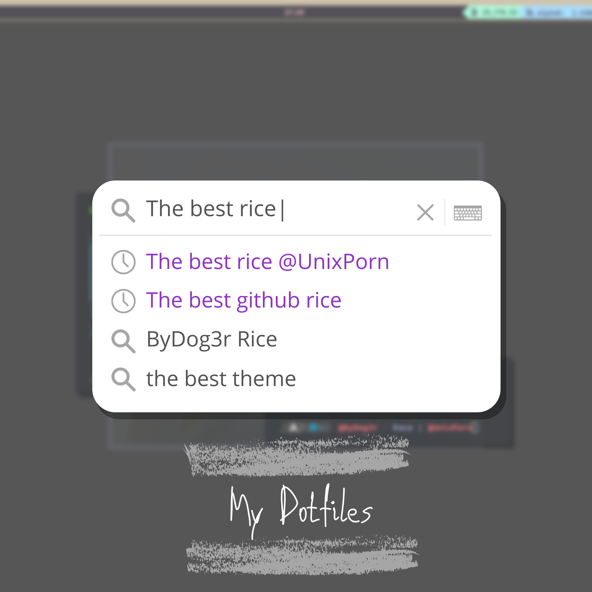

<p align="center">
  <a href="https://vimeo.com/716954955">
  
  </a>
</p>

<p align="center">
  <a href="https://github.com/ByDog3r/dotfiles/wiki/"></a>
  <a href="https://github.com/ByDog3r/dotfiles#install-this-dotfiles"></a>
  <a href="https://vimeo.com/716954955"></a>
</p>

<p align="center">
  <b>< Dotfiles & Configs /></b>
</p>

<!-- RICE PREVIEW -->
<div align="center">
   <a href="assets/ricing.jpg">
      
   </a>
</div>


<h1>
  <a href="#--------">
    
  </a>
  <a href="#--------">
    
  </a>
</h1>

## Install this dotfiles
[Read dotfiles wiki](https://github.com/ByDog3r/dotfiles/wiki) to install for manual way.

> **Clone my dotfiles**
```sh 
git clone https://github.com/ByDog3r/dotfiles
```

> Copy my Configs
```sh
cp -r .config* ~/.config/     
```

> Copy the home files
```sh
cp .home/* ~/
```

> [Install apps](https://github.com/ByDog3r/dotfiles/blob/main/.pkgs), sample to install
```sh
sudo pacman -S wine
```

> Set your wallpaper, edit [.xprofile](https://github.com/ByDog3r/dotfiles/blob/main/.home/.xprofile) and find this line 
```sh
feh --bg-scale /usr/share/pixmaps/wallpaper0.png &
```

## Details

Below is a list of some of the packages that I use for my current setup.

- **Operating System** --- [Archlinux](https://www.archlinux.org/)
- **AUR Helper** --- [Paru](https://aur.archlinux.org/packages/paru-git/)
- **Pentesting repositories** --- [BlackArch](https://blackarch.org/strap.sh)
- **Boot Loader** --- [Grub](https://wiki.archlinux.org/index.php/GRUB)
- **Window Manager** --- [Qtile](https://aur.archlinux.org/packages/qtile-git)
- **Screen Locker** --- [Betterlockscreen](https://aur.archlinux.org/packages/betterlockscreen)
- **Login Manager** -- [LightDM](https://wiki.archlinux.org/title/LightDM)
- **Shell** --- [ZSH](https://www.zsh.org)
- **Terminal** --- [Kitty](https://wiki.archlinux.org/index.php/Kitty)
- **Compositor** --- [Picom](https://wiki.archlinux.org/index.php/Picom)
- **Font** --- [Ubuntu-mono Nerd Font](https://aur.archlinux.org/packages/nerd-fonts-ubuntu-mono)
- **Notification Daemon** --- [Dunst](https://wiki.archlinux.org/index.php/Dunst)
- **Application Launcher** --- [Rofi](https://wiki.archlinux.org/index.php/Rofi)
- **File Manager** --- [Ranger](https://aur.archlinux.org/packages/ranger-git) & [Thunar](https://docs.xfce.org/xfce/thunar/start)
- **Editor** --- [Neovim](https://aur.archlinux.org/packages/neovim-git)
  - **Plugins**
	- [NvChad](https://nvchad.github.io)
- **Web Browser** --- [Opera](https://www.opera.com)
- **PDF Viewer** --- [Okular](https://okular.kde.org)
- **Video player** --- [Mpv](https://aur.archlinux.org/packages/mpv-git)
- **Screen Recorder** --- [SimpleScreenRecorder](https://www.maartenbaert.be/simplescreenrecorder/)
- **Run Windows applications** --- [Wine](https://www.winehq.org)

## Keybindings
I use <kbd>mod/super</kbd> AKA Windows key as my main modifier.
also with <kbd>alt, shift, and ctrl</kbd>

<details>
<summary><b>Window Manager</b></summary>

| Keys                                 | Action                         |
| ------------------------------------ | ------------------------------ |
| <kbd>MOD + j</kbd>                   | Next windown (down)            |
| <kbd>MOD + k</kbd>                   | Next windown (up)              |
| <kbd>MOD + SHIFT + h</kbd>           | Decrease master                |
| <kbd>MOD + SHIFT + l</kbd>           | Increase master                |
| <kbd>MOD + SHIFT + j</kbd>           | Move window down               |
| <kbd>MOD + SHIFT + k</kbd>           | Move window up                 |
| <kbd>MOD + SHIFT + f</kbd>           | Toggle floating                |
| <kbd>MOD + TAB</kbd>                 | Change layout                  |
| <kbd>MOD + w</kbd>                   | kill window                    |
| <kbd>MOD + RETURN</kbd>              | spawn terminal                 |
| <kbd>MOD + [1-7]</kbd>               | Switch to workspace N (1-7)    |
| <kbd>MOD + SHIFT + [1-7]</kbd>       | Send window to workspace (1-7) |
| <kbd>MOD + PERIOD</kbd>              | Focus next monitor             |
| <kbd>MOD + COMMA</kbd>               | Focus previous monitor         |
| <kbd>MOD + u</kbd>                   | Full Screen                    |
| <kbd>MOD + x</kbd>                   | Hide bar                       |
| <kbd>MOD + CTRL + r</kbd>            | Restart Qtile WM               |
| <kbd>MOD + CTRL + q</kbd>            | Quit WM (Window Manager)       |

</details>

<details>
<summary><b>Application</b></summary>
	
| keys                                 | Action                    |
|--------------------------------------|---------------------------|
| <kbd>MOD + m</kbd>                   | Rofi Menu                 |
| <kbd>MOD + SHIFT + m</kbd>           | Nav Menu                  |
| <kbd>MOD + b</kbd>                   | Launch Opera              |
| <kbd>MOD + e</kbd>                   | Launch Thunar             |
| <kbd>MOD + r</kbd>                   | Run Redshift              |
| <kbd>MOD + SHIFT + r</kbd>           | Stop Redshift             |
| <kbd>MOD + Print</kbd>               | Take Screenshot (scrot)   |
| <kbd>MOD + SHIFT + Print</kbd>       | SCreenshot to clipboard   |

</details>

## Terminal Commands

<details>
<summary><b>ZSH Aliases</b></summary>

| Command                              | Function                    |
|--------------------------------------|-----------------------------|
| update                               | Update and upgrade os-tools |
| install                              | Paru installer              |
| clone                                | Clone repositorie           |
| hclean                               | Clean terminal history      |
| uninstall                            | Pacman and paru uninstall   |
| neofetch                             | Run neofetch config         |

</details>

<details>
<summary><b>ZSH Functions</b></summary>

| Command                              | Function                          |
|--------------------------------------|-----------------------------------|
| rmk                                  | Remove file (forense function)    |
| mkt                                  | Make pentest directorys (s4vitar) |
| extractPorts                         | Extract Ports                     |

</details>


<br>

<p align="center"></p>
